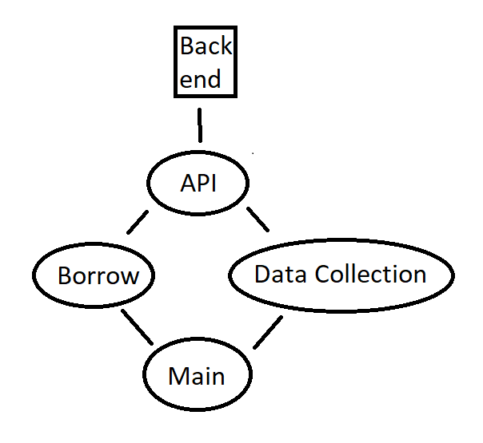
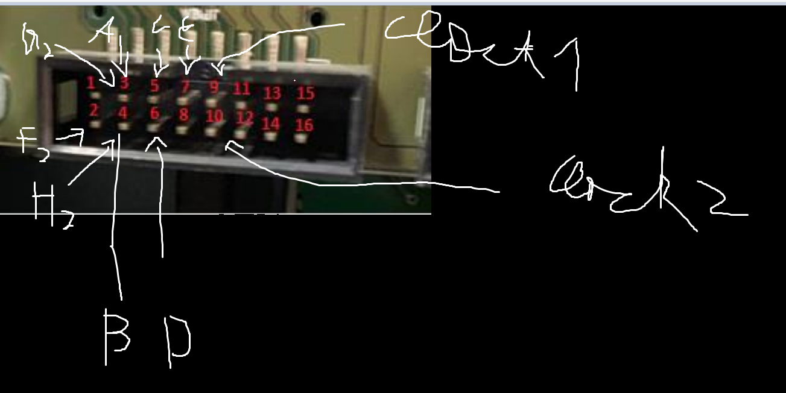

# Controller-ZIDAutomat
The Controller for the actuall hardware

## Projekt 
Das Projekt besteht aus 3 Teilen, dem API Teil(der API Client, welche die Methoden bereitstellt um mit dem Backend zu kommunizieren), den DataCollection Teil(dort finden sich Funktionen, die Daten sammeln(Historie...)) und dem Borrow Teil(Das ist der Core des Controllers. Dort finden sich Funktionen zum ausgeben von Artikeln und QR Code Scannen...)

  

## How does the ejecting work?

Ziel ist es im Prinzip einfach die Tastatur durch unseren ESP zu ersetzen. Es gibt zwei Clocks,
welche entweder für die Tasten ABCDE oder für die Tasten FGH zuständig ist. DIe Clock gibt das Timing vor.
Welche Pins für welchen Buchstaben steht kann aus der Grafik abgelesen werden.

Clock ist so ein komisches wellen Signal. Wenn nun ein Button gedrückt werden soll wird der entsprechende Pin erstmal auf on
geschalten. Dann wird gewartet, bis sich die jeweilige Clock gegen 0 nähert. Wenn sie sich 0 nähert wird der Pin wieder ausgeschalten und es 
wird kurz gewartet.

In der obrigen Grafik sind die Buchstaben mit einer kleinen2 der Clock 2 zugehörig.

## How does the QRCodeReader work?

Der QRCodeReader ist recht simple. Es funktioniert über eine Serielle Verbindung. Wichtig ist dabei zu beachten, dass der
richtige Rx Pin verwendet wird. Die Clockrate ist 9600
